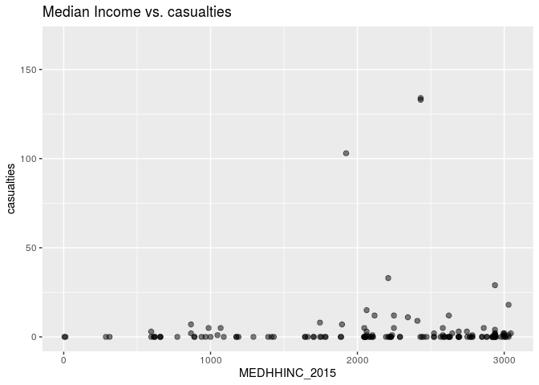
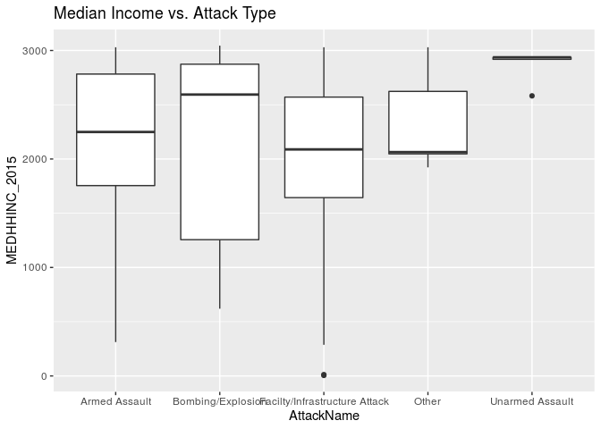

Reading in data, removing duplicate observations

```r
library("tidyverse")
library("dplyr")
county_city <- read.csv(file='data/county_city.csv')
GTD <- read.csv(file='data/GTD.csv')
population <- read.csv(file='data/population.csv', encoding = "UTF-8")
poverty <- read.csv(file='data/poverty.csv')
county_city <- unique(county_city)
GTD <- unique(GTD)
population <- unique(population)
poverty <- unique(poverty)
```

Remove the states from the population, poverty, and county_city dataset that are not in the GTD dataset to make them more manageable.

```r
r_countycity <- subset(county_city, !(state %in% c('AA','AE', 'AL','AK','AP','AR','AS','DE','FM','GU','HI','KY','MD','ME','MH','MT','MP','OK','PR','PW','RI','SD','WI','WY','UT','VI','VT')))
r_poverty <- subset(poverty, !((State %in% c('AA','AE', 'AL','AK','AP','AR','AS','DE','FM','GU','HI','KY','MD','ME','MH','MT','MP','OK','PR','PW','RI','SD','WI','WY','UT','VI','VT'))))
r_population <- subset(population, (STNAME %in% c('Arizona','California','Colorado','Connecticut','Florida','Georgia','Idaho','Illinois','Indiana','Iowa','Kansas','Louisiana','Massachusetts','Michigan','Minnesota','Mississippi','Missouri','Nebraska','Nevada','New Hampshire','New Jersey','New Mexico','New York','North Carolina','North Dakota','Ohio','Oregon','Pennsylvania','South Carolina','Tennessee','Texas','Virginia','Washington','West Virginia','District of Columbia')))
r_population$PLACE[r_population$PLACE==0 & r_population$NAME %in% c("Blooming Grove township","Colerain township","Macon County","West Orange township","Tyngsborough town","Indianapolis city")] <- 1
r_population <- subset(r_population, !(PLACE %in% c(0,39003,11810,25170,99990)))
```

Renaming and adding variables to the population, poverty, and county_city datasets to make merging possible

```r
#r_countycity
r_countycity$two_county <- NA
r_countycity$two_county <- paste(r_countycity$county, 'County')
r_countycity$State <- as.character(r_countycity$state)
#adding locations that are in GTD/population/poverty but not in county_city into county_city
PA_BG <- data.frame(c(0,0),c(0,0),c("Blooming Grove township","Colerain township", "Corinth","Overland Park"),c("PA","PA","TX","KS"),c("Pike","Lancaster","Denton","Johnson"), c("Pike County","Lancaster County","Denton County","Johnson County"),c("PA","PA","TX","KS"))
names(PA_BG) <- c("latitude","longitude","city","state","county","two_county","State")
r_countycity <- rbind(r_countycity, PA_BG)
r_countycity$city <- as.character(r_countycity$city)
#r_poverty
r_poverty$two_county <- as.character(r_poverty$Area_Name)
r_poverty$State <- as.character(r_poverty$State)
#r_population
r_population$provstate <- r_population$STNAME
r_population$city <- r_population$NAME
r_population$city <- as.character(r_population$city)
r_population$provstate <- as.character(r_population$provstate)
```

Changing the spelling/capitalization of certain observations to make merging possible.

```r
r_poverty$two_county[r_poverty$two_county=="East Baton Rouge Parish"] <- "East Baton Rouge County"
r_poverty$two_county[r_poverty$two_county=="Orleans Parish"] <- "Orleans County"
r_poverty$two_county[r_poverty$two_county=="Lafayette Parish"] <- "Lafayette County"
r_poverty$two_county[r_poverty$two_county=="St. Lucie County"] <- "Saint Lucie County"
r_population$city[r_population$city=="Century town"] <- "Century city"
r_countycity$city[r_countycity$city=="Mc Cook"] <- "McCook"
r_countycity$city[r_countycity$city=="Tyngsboro"] <- "Tyngsborough"
r_countycity$two_county[r_countycity$two_county=="Saint Louis County"] <- "St. Louis County"
r_countycity$two_county[r_countycity$two_county=="District Of Columbia County"] <- "District of Columbia"
```


Merging county_city and poverty, add variable for the full state name to make future merging possible, update a few variables and observations.

```r
#merging the county_city and poverty datasets
pov_countcity <- inner_join(r_countycity, r_poverty)
```

```
## Joining, by = c("two_county", "State")
```

```r
#edit state names/abbreviations for consistency
pov_countcity$provstate <- state.name[match(pov_countcity$State,state.abb)]
#make city and state variables character variables
pov_countcity$provstate <- as.character(pov_countcity$provstate)
pov_countcity$city <- as.character(pov_countcity$city)
pov_countcity <- unique(pov_countcity)
pov_countcity$city[pov_countcity$city=="New York"] <- "New York City"
pov_countcity$city[pov_countcity$city=="Saint Louis"] <- "St. Louis"
pov_countcity$city[pov_countcity$city=="Saint Cloud"] <- "St. Cloud"
pov_countcity$city <- toupper(pov_countcity$city)
```
Remove variables that are no longer necessary

```r
pov_countcity <- subset(pov_countcity, select = -c(Area_Name, state, longitude, latitude))
```

Update GTD dataset to make merging possible

```r
GTD$provstate <- as.character(GTD$provstate)
GTD$city <- as.character(GTD$city)
GTD$city[GTD$city=="Ingelwood"] <- "Inglewood"
GTD$city[GTD$city=="Blooming Grove"] <- "Blooming Grove township"
GTD$city[GTD$city=="Colerain"] <- "Colerain township"
pov_countcity$provstate[pov_countcity$State=="DC"] <- "District of Columbia"
GTD$city <- toupper(as.character(GTD$city))
```

Merging GTD with the poverty/county_city dataset

```r
GTD_pov_CC <- left_join(GTD,pov_countcity)
```

```
## Joining, by = c("provstate", "city")
```

```r
GTD_pov_CC <- unique(GTD_pov_CC)
```

Update city names for ease of merging to population

```r
GTD_pov_CC$fullcity <- paste(GTD_pov_CC$city, 'CITY')
```

Change spelling and town/township/borough/village to 'city'

```r
GTD_pov_CC$fullcity[GTD_pov_CC$fullcity=="BLOOMING GROVE TOWNSHIP CITY"] <- "BLOOMING GROVE TOWNSHIP"
GTD_pov_CC$fullcity[GTD_pov_CC$fullcity=="COLERAIN TOWNSHIP CITY"] <- "COLERAIN TOWNSHIP"
GTD_pov_CC$fullcity[GTD_pov_CC$fullcity=="NEW YORK CITY CITY"] <- "NEW YORK CITY"
GTD_pov_CC$fullcity[GTD_pov_CC$fullcity=="NEW CITY CITY"] <- "NEW CITY"

r_population$fullcity <- toupper(r_population$city)
r_population$fullcity[r_population$fullcity=="BULLARD TOWN"] <- "Bullard city"
r_population$fullcity[r_population$fullcity=="CHAPEL HILL TOWN"] <- "Chapel Hill city"
r_population$fullcity[r_population$fullcity=="WEST ORANGE TOWNSHIP"] <- "West Orange city"
r_population$fullcity[r_population$fullcity=="MACON COUNTY"] <- "Macon city"
r_population$fullcity[r_population$fullcity=="ORLAND PARK VILLAGE"] <- "Orland Park city"
r_population$fullcity[r_population$fullcity=="NASHVILLE TOWN"] <- "Nashville city"
r_population$fullcity[r_population$fullcity=="STRASBURG BOROUGH"] <- "Strasburg city"
r_population$fullcity[r_population$fullcity=="HILLSBOROUGH TOWN"] <- "Hillsborough city"
r_population$fullcity[r_population$fullcity=="SEASIDE PARK BOROUGH"] <- "Seaside Park city"
r_population$fullcity[r_population$fullcity=="ENDICOTT VILLAGE"] <- "Endicott city"
r_population$fullcity[r_population$fullcity=="WATERTOWN TOWN CITY"] <- "Watertown city"
r_population$fullcity[r_population$fullcity=="TYNGSBOROUGH TOWN"] <- "Tyngsborough city"
```

make city names capitalized, remove unneeded variables.

```r
GTD_pov_CC$fullcity <- toupper(GTD_pov_CC$fullcity)
r_population$fullcity <- toupper(r_population$fullcity)
GTD_pov_CC <- subset(GTD_pov_CC, select = -c(State, two_county, city))
r_population <- subset(r_population, select = -c(NAME, STNAME, city, SUMLEV, STATE, COUNTY, PLACE))
```

Final Merge

```r
final <- left_join(GTD_pov_CC, r_population)
```

```
## Joining, by = c("provstate", "fullcity")
```

```r
final <- unique(final)
```
NOTE: Princeton city and Warrenville city are not present in the population dataset, and so the population values are are missing in the final data set for those observations. West city is not present in the poverty dataset, so the poverty values are missing in the final dataset for this observation. Lake Los Angeles is missing in both the poverty and population datasets, so those values are missing for that observation.

Creating final dataset. Changes the format of particular variables, as well as creates variables necessary for future analysis.

```r
final$summary <- as.character(final$summary)
midterm_data_forcev.csv <- final[!duplicated(final$summary),]
midterm_data_forcev.csv <- midterm_data_forcev.csv %>% mutate(avg_population = ((POPESTIMATE2013 + POPESTIMATE2014 + POPESTIMATE2015 + POPESTIMATE2016)/4)/100, casualties = nkill + nwound)
midterm_data_forcev.csv$MEDHHINC_2015 <- as.numeric(midterm_data_forcev.csv$MEDHHINC_2015)
midterm_data_forcev.csv$claimed[midterm_data_forcev.csv$claimed==1] <- "Yes"
midterm_data_forcev.csv$claimed[midterm_data_forcev.csv$claimed==0] <- "No"
midterm_data_forcev.csv$individual[midterm_data_forcev.csv$individual==1] <- "Unaffiliated"
midterm_data_forcev.csv$individual[midterm_data_forcev.csv$individual==0] <- "With group or unknown"
midterm_data_forcev.csv$fulldate <- paste(midterm_data_forcev.csv$iyear,'-', midterm_data_forcev.csv$imonth,'-',midterm_data_forcev.csv$iday)
```

QUESTION ONE

```r
p <- ggplot(midterm_data_forcev.csv, mapping = aes(x=longitude, y=latitude, color=avg_population)) + geom_point(alpha = (1/2), size = 2)
p + labs(title="Map of United States", subtitle = "Terrorist attacks and population in hundreds")
```

<!-- -->

```r
a <- ggplot(midterm_data_forcev.csv, mapping = aes(x=longitude, y=latitude, color=PCTPOVALL_2015)) + geom_point(alpha = (1/2), size = 2)
b <- ggplot(midterm_data_forcev.csv, mapping = aes(x=longitude, y=latitude, color=PCTPOV017_2015)) + geom_point(alpha = (1/2), size = 2)
c <- ggplot(midterm_data_forcev.csv, mapping = aes(x=longitude, y=latitude, color=MEDHHINC_2015)) + geom_point(alpha = (1/2), size = 2)
a + labs(title="Map of United States", subtitle = "Terrorist attacks and percent of population living in poverty")
```

<!-- -->

```r
b + labs(title = "Map of United States", subtitle = "Terrorist attacks and percent fo children living in poverty")
```

<!-- -->

```r
c + labs(title = "Map of United States", subtitle = "Terrorist attacks and median income")
```

<!-- -->
Overall, not many trends can be identified with these charts. There are too few observations of terrorist attacks to make any definitive statements about the population or poverty rates in the places in which the attacks took place.

QUESTION TWO

```r
d <- ggplot(midterm_data_forcev.csv, mapping = aes(x=imonth, fill=individual)) + geom_bar(stat="count", position="stack")
e <- ggplot(midterm_data_forcev.csv, mapping = aes(x=imonth, fill=claimed)) + geom_bar(stat="count", position="stack")
d + labs(fill="Individual or group?", x="Month") + scale_x_discrete(limits=c(1,2,3,4,5,6,7,8,9,10,11,12))
```

<!-- -->

```r
e + labs(fill="Claimed?", x="Month") + scale_x_discrete(limits=c(1,2,3,4,5,6,7,8,9,10,11,12))
```

<!-- -->
Attacks were less frequently carried out by unaffiliated individuals, and and slightly less often claimed by a group or individual. This also shows that terrorist attacks appear with the a similar rate of frequency as general crime - higher in the summer, lower in the winter. I would hypothesize that there is a slight increase in attacks arround December to be due to the holidays, so there are an increased number of targets with a lot of people. 

QUESTiON THREE

```r
onepoint <- subset(midterm_data_forcev.csv, fullcity=="WEST CITY")
f <- ggplot(midterm_data_forcev.csv, mapping = aes(x=avg_population, y=casualties)) + geom_point(alpha = (1/2), size = 2)
g <- ggplot(midterm_data_forcev.csv, mapping = aes(x=PCTPOVALL_2015, y=casualties)) + geom_point(alpha = (1/2), size = 2)
h <- ggplot(midterm_data_forcev.csv, mapping = aes(x=PCTPOV017_2015, y=casualties)) + geom_point(alpha = (1/2), size = 2)
i  <- ggplot(midterm_data_forcev.csv, mapping = aes(x=MEDHHINC_2015, y=casualties)) + geom_point(alpha = (1/2), size = 2)
f + geom_point(data=onepoint, colour="red") + geom_text(data=onepoint, label=onepoint$gname, vjust=2) + labs(x="Average population in hundreds", title = "Population vs. Casualties") 
```

```
## Warning: Removed 5 rows containing missing values (geom_point).
```

<!-- -->

```r
g + labs(title = "% living in poverty vs. casualties")
```

```
## Warning: Removed 2 rows containing missing values (geom_point).
```

<!-- -->

```r
h + labs(title = "% of children living in poverty vs. casualties")
```

```
## Warning: Removed 2 rows containing missing values (geom_point).
```

<!-- -->

```r
i + labs(title = "Median Income vs. casualties")
```

```
## Warning: Removed 2 rows containing missing values (geom_point).
```

<!-- -->

The majority of the terrorist attacks had fewer than 25 casualities, and occured in places with a population less than 2,000,000. The percent of the local population living in poverty is fairly evenly distributed. The median income is skewed left.

QUESTION FOUR

```r
midterm_data_forcev.csv$AttackName[midterm_data_forcev.csv$attacktype1 %in% c(1,4,5)] <- "Other"
midterm_data_forcev.csv$AttackName[midterm_data_forcev.csv$attacktype1==2] <- "Armed Assault"
midterm_data_forcev.csv$AttackName[midterm_data_forcev.csv$attacktype1==3] <- "Bombing/Explosion"
midterm_data_forcev.csv$AttackName[midterm_data_forcev.csv$attacktype1==7] <- "Facilty/Infrastructure Attack"
midterm_data_forcev.csv$AttackName[midterm_data_forcev.csv$attacktype1==8] <- "Unarmed Assault"
j <- ggplot(midterm_data_forcev.csv, aes(x=AttackName, y=avg_population)) + geom_boxplot()
k <- ggplot(midterm_data_forcev.csv, aes(x=AttackName, y=PCTPOVALL_2015)) + geom_boxplot()
l <- ggplot(midterm_data_forcev.csv, aes(x=AttackName, y=PCTPOV017_2015)) + geom_boxplot()
m <- ggplot(midterm_data_forcev.csv, aes(x=AttackName, y=MEDHHINC_2015)) + geom_boxplot()
j + labs(title = "Average Population (in hundreds) vs. Attack Type")
```

```
## Warning: Removed 5 rows containing non-finite values (stat_boxplot).
```

<!-- -->

```r
k + labs(title = "% Living in Poverty vs. Attack Type")
```

```
## Warning: Removed 2 rows containing non-finite values (stat_boxplot).
```

<!-- -->

```r
l + labs(title = "% of Children Living in Poverty vs. Attack Type")
```

```
## Warning: Removed 2 rows containing non-finite values (stat_boxplot).
```

<!-- -->

```r
m + labs(title = "Median Income vs. Attack Type")
```

```
## Warning: Removed 2 rows containing non-finite values (stat_boxplot).
```

<!-- -->

The unarmed assault cateogry is definitely of the most interest to me in these graphs. It has the widest range of population by far, but the narrowest range for both poverty stats and median income. It also has the highest median income of all the attack types. It only has 6 observations, but other categories also have low numbers and do not have similar characteristics.

QUESTION FIVE

```r
midterm_data_forcev.csv$property[midterm_data_forcev.csv$property==1] <- "Yes"
midterm_data_forcev.csv$property[midterm_data_forcev.csv$property==0] <- "No"
midterm_data_forcev.csv$property[midterm_data_forcev.csv$property==-9] <- "Unknown"
table(midterm_data_forcev.csv$AttackName,midterm_data_forcev.csv$property)
```

```
##                                
##                                 No Unknown Yes
##   Armed Assault                 25       5  17
##   Bombing/Explosion              8       3  15
##   Facilty/Infrastructure Attack  4       0  57
##   Other                          3       0   2
##   Unarmed Assault                6       0   1
```

```r
table(midterm_data_forcev.csv$AttackName,midterm_data_forcev.csv$individual)
```

```
##                                
##                                 Unaffiliated With group or unknown
##   Armed Assault                           40                     7
##   Bombing/Explosion                       13                    13
##   Facilty/Infrastructure Attack           12                    49
##   Other                                    5                     0
##   Unarmed Assault                          6                     1
```

I find the relationship between attack type and property to be confusing here. According to this data, there were 8 bombing/explosion and 4 facilty/infrastructure attacks that resulted in no property damage. How bad were the perpetrators of theses 12 attacks to set off a bomb or specifically target a facility and yet no property damage resulted?
The majority of armed assult were unaffiliated, which makes sense. 
